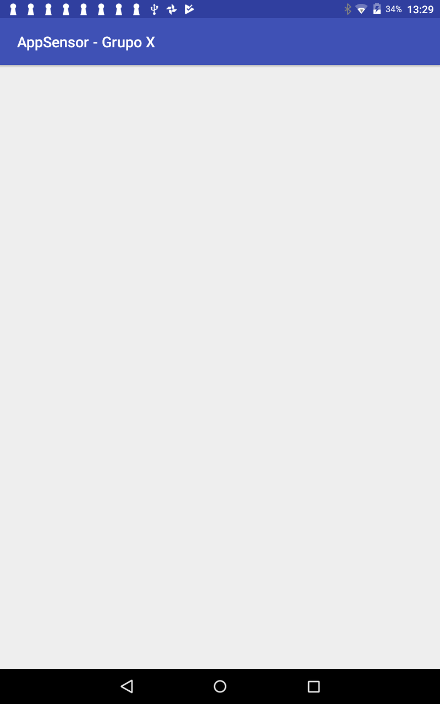

= Taller Conjunto - App Android con Sensores

== Instalación de herramientas (opcional)

Para realizar una aplicación en Android, es necesario tener instalados
ciertos programas en nuestras computadoras.

El principal programa que se necesita tener instalado se conoce como el
Andriod Studio y sirve para programar aplicaciones en Android.

En este taller no será necesario descargar ninguna aplicación como el Android
Studio ya que ya se encuentra instalado. En caso quieras volver a hacer la
experiencia en casa, deberás instalarlo por tu cuenta según la página web
que te indico a contianuación:

- https://developer.android.com/studio/install.html?hl=es-419

== Abrir herramienta de desarrollo IDE (Android Studio)

Para abrir el IDE Android Studio, simplemente se hare click en el ícono verde
que se encuentra en el escritorio de la computadora lo que mostrará la siguiente
pantalla:

image:imagenes/t1_imagen1.png[]

Debe seleccionar "Open an existing Android Studio Project" y elegir el programa
que se debe encontrar en su computadora. La dirección exacta le será proporcionada
por el profesor encargado del taller.

Luego de seleccionar el programa a cargar, deberá salir la siguiente pantalla:

Para ver si el Android Studio puede ver el handset, se debe hacer click en el play
(parte superior) y ver lo siguiente:

En caso de mostrar dispositivos conectados, Android Studio ha sido configurado de la
manera correcta.

== Ejecutar aplicación MedidorULima

En el paso anterior han cargado en el IDE Android Studio una aplicación
Android funcional. Ahora vamos a hacer algunos cambios para personalizar
mejor nuestra aplicación.

=== 1. Modificar el archivo res/mvalues/strings.xml

Entrar en el archivo llamado strings.xml y modificarlo para
poner el número de grupo al que pertenecen.

[source,xml,linenums]
----
<resources>
    <string name="app_name">AppSensor - Grupo X</string> #<1>
    <string name="grupo">Grupo X</string> #<2>
    <string name="buscar">Buscar</string>
    <string name="instrucciones_pareo">Como primer paso debemos parear nuestra aplicación con un sensor que se encuentra funcionando en nuestro Arduino.\n
    Para esto deben tener un dispositivo Arduino encendido con la aplicación Sensor funcionando y enviando data y pareado con el dispositivo móvil. En caso
        de tener problemas con el pareo, puede solicitar ayuda.\nLuego de tenerlo pareado, hacer click en el botón buscar y hacer click en el dispositivo pareado.
    </string>
</resources>
----
<1> Debe de modificar los valores según a su grupo.
<2> Debe de modificar los valores según su grupo.

=== 2. Ejecutar la aplicación en un equipo Android

Para ejecutar la aplicación, deberán de asegurarse que se encuentre
conectado una handset en la computadora donde va a desarrollar el
taller.

Para iniciar la aplicación, debe de salirles las siguientes
pantallas:

