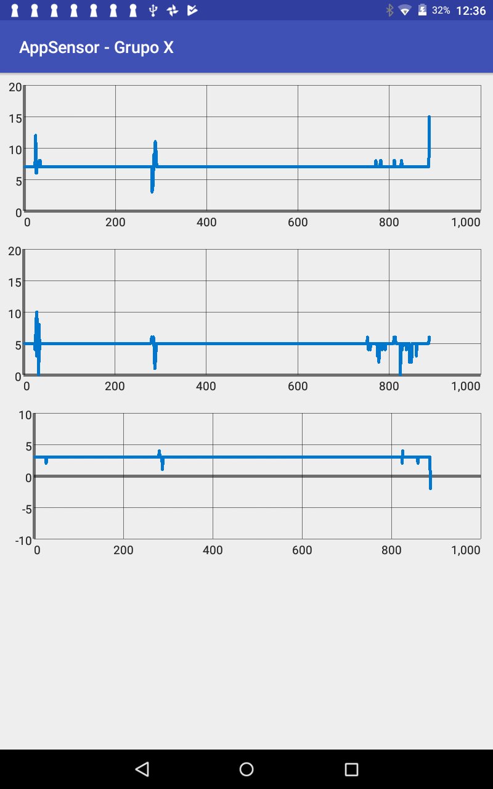

= Taller Conjunto - App Android con Sensores

== Mostrando data del sensor

=== 1. Configuramos los elementos de la pantalla

Siempre al inicial una pantalla en Android, se deben configurar los
elementos gráficos (botones, textos, listados, etc.). Para esto en la
función _onCreate_ deberá de agregar el siguiente código:

[source,java,linenums]
----
configurarElementosPantalla();
----

=== 2. Iniciar la recepción de data

Necesitamos iniciar la comunicación con el dispositivo arduino que
se encuentra emitiendo señales mediante Bluetooth y que ya se
encuentra pareado (que hicimos en la guía anterior).

Para esto, en la función _onCreate_, luego de haber configurado
los elementos de pantalla llamaremos a la función iniciarRecepcionDeBluetooth.

[source, java, linenums]
----
iniciarRecepcionDeBluetooth();
----

=== 3. Procesar la data enviada por el emisor

El dispositivo emisor mediante Bluetooth enviará datos al handset
y este los va recibiendo trama por trama.

Una trama es un conjunto de valores binarios (0s o 1s) que el
handset interpreta como número o letras. Para nuestro caso,
el handset lo interpretará como 3 valores (aceleraciones en
el eje X, eje Y y eje Z).

Para realizar esto, debemos llamar a la función que se encarga de
hacer esa lectura. En nuestro caso, esta función se llama
_procesarDataObtenida_.

Esta función la pondremos dentro otra función llamada OnDataObtained
que será llamada por el sistema cada vez que se encuentre una nueva
trama enviada por el emisor de bluetooth.

[source,java,linenums]
----
private void iniciarRecepcionDeBluetooth() {
  new BTConnection(new OnDeviceDataListener() {
      @Override
      public void onDataObtained(byte[] trama) {
        procesarDataObtenida(trama); #<1>
      }
  }).execute();
}
----
<1> Función que se encarga de procesar la trama obtenida.

Si todo está correcto, deberá de verse en la consola de Android
Studio los datos que se están obtenido en el censor.

También se deberá ver que el handset comenzará a mostrar las
gráficas de los datos.

